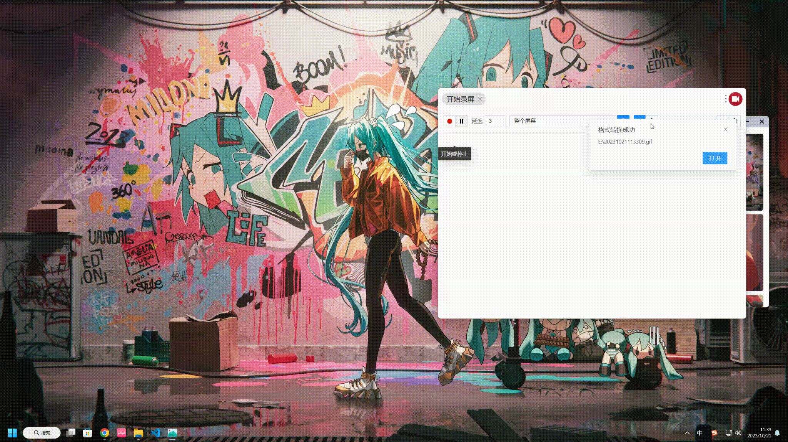

# wallpaper

> 壁纸软件，软件内部壁纸来源：[https://wallhaven.cc/](https://wallhaven.cc/)

## 预览

## 下载

### Windows

+ [exe-安装程序](https://gitee.com/T-_-C/wallpaper/releases/download/V1.0/wallpaper-1.0.0-setup.exe)
+ [rar-解压即用](https://gitee.com/T-_-C/wallpaper/releases/download/V1.0/wallpaper-win-1.0.0.rar)

### MacOS

> 暂未测试mac平台

## 打包

> 根据需要自己打包

1. 克隆或下载代码到本地
2. 进入项目目录
3. 安装依赖包 `pnpm install  `
4. 根据个人需求打包

