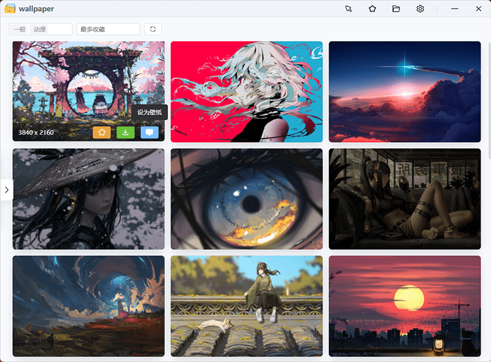
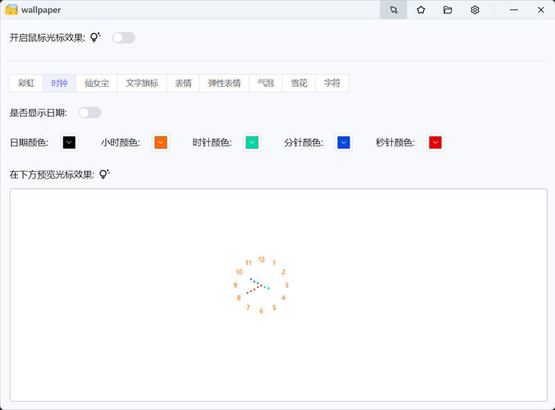
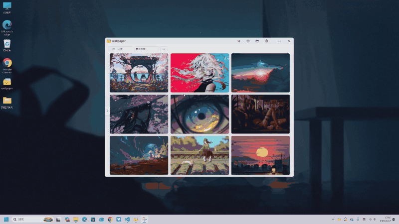
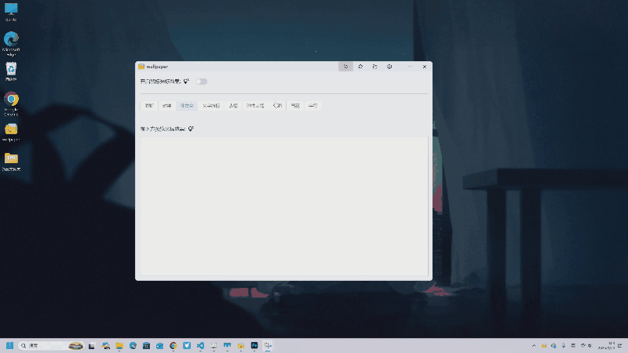

# wallpaper

> 一款支持win/mac平台的一键切换壁纸软件。

+ 支持一键更换图片为壁纸。
+ 支持一键更换视频为壁纸。
+ 可系统级应用多种鼠标光标跟随效果。

### 应用内截图

### 一键设置为图片壁纸

### 一键设置为动态壁纸

### 设置鼠标光标效果

## 下载
> Release内下载对应平台安装包。

## 打包

> 需要环境：node.js >= 22; python >= 3.6; rust。

1. 克隆或下载代码到本地
2. 进入项目目录
3. 安装依赖包 `npm install`
4. 打包命令 `npm run build:win/mac`

